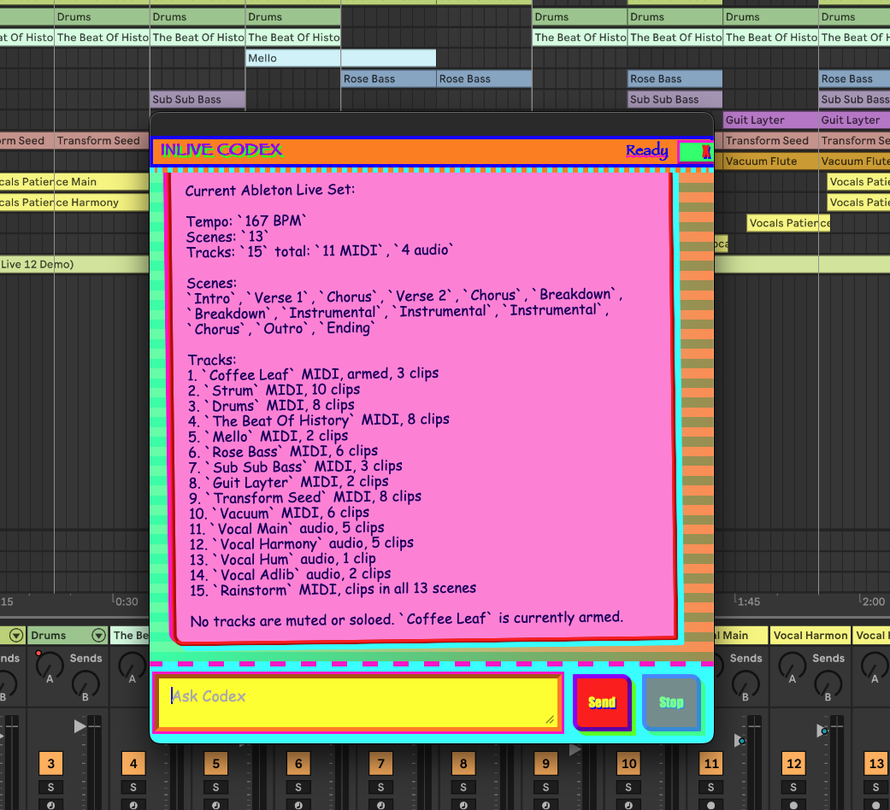

# InLive

InLive is an Ableton Live extension that drops Codex into Live's context menus. Right-click a supported Live surface, choose `Extensions > In Live...`, and you get a tiny Codex chat panel wired to the current ExtensionHost. It is ugly on purpose right now. That is not a bug; it is a warning label with pixels.



## The Nuts

- Live owns the UI surface.
- ExtensionHost owns the bridge.
- Codex runs in app-server mode.
- The webview talks to InLive, not directly to Codex.
- `js-in-live` lets Codex run JavaScript inside the ExtensionHost instead of guessing what Live is doing.

No ghost menus. No silent fallbacks. If a layer is not alive, the tooling should say so loudly.

## Daily Dev Loop

Start the reloadable runtime:

```sh
npm run dev
```

Start the managed Live ExtensionHost once:

```sh
npm run live:dev
```

Then right-click a supported Live surface and open `Extensions > In Live...`.

Reloads without restarting Live or ExtensionHost:

- Chat UI, CSS, and client protocol through Vite HMR.
- Dev bridge and Codex app-server bridge behavior through `tsx watch`.
- Browser reconnects through stable dev ports: Vite `15173`, bridge HTTP `15174`, WebSocket `15175`.

Still needs an ExtensionHost restart:

- Command registration.
- Context menu scopes.
- The bootstrap call to `showModalDialog`.

## Recovery

When Live has no `Extensions` submenu, do not stare at it. Ask the machine.

```sh
npm run doctor
```

If the host is stale or missing, restart only InLive's ExtensionHost:

```sh
npm run host:restart
```

Stop only InLive's ExtensionHost:

```sh
npm run host:stop
```

Healthy means:

- One InLive ExtensionHost process.
- Fresh `/tmp/inlive-extension-status.json`.
- `12/12` registered context menu scopes.
- Dev bridge health is OK.

## JS Runner

In dev mode, the ExtensionHost starts a local JS runner on port `15176`. The CLI reads its URL and token from `/tmp/inlive-extension-status.json`.

Run a snippet inside the ExtensionHost:

```sh
./bin/js-in-live -e "console.log('Live?', Boolean(live.ui)); return process.cwd();"
```

Run a file:

```sh
./bin/js-in-live ./probe.js --arg count=2
```

Scripts receive `live`, `sdk`, `console`, `args`, and ExtensionHost-side `require`.

## Codex Context

Codex app-server threads launched by InLive receive `js-in-live` on `PATH` and developer instructions that describe the runner. When Codex needs Live SDK truth, it should use `js-in-live` instead of shell vibes or browser archaeology.

The launch context includes:

- Runner path.
- App-server args.
- Working directory.
- Developer instruction hash.

If that context changes while Codex is idle, InLive restarts the app-server thread. If a turn is active, stop the turn first. Stale prompt or environment reuse is forbidden.

## Production

Build the bundled extension:

```sh
npm run build
```

Production does not depend on Vite. It keeps the bundled host bridge and inlined modal assets.

## Supported Menu Surfaces

`In Live...` is a context-menu action, not a global top-level Live menu. Look for it on SDK-supported surfaces such as clips, tracks, scenes, clip slots, Simpler, Sample, Drum Rack, and arrangement selections.
